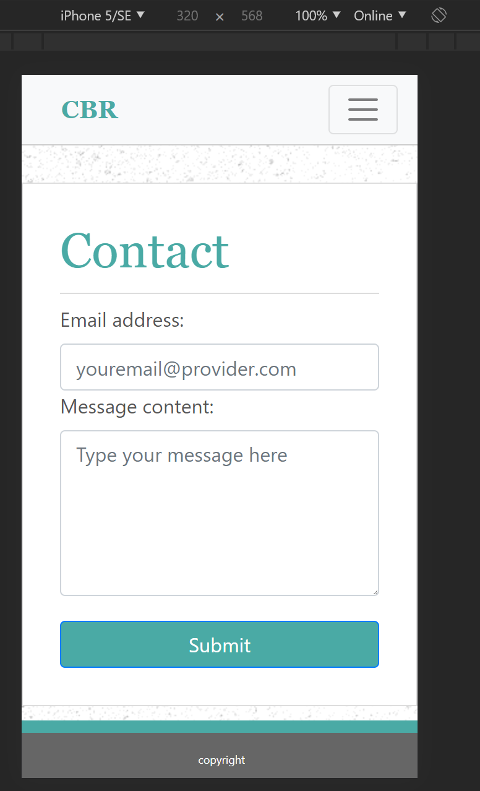

# Personal Resume

An HTML resume site that utilizes Bootstrap to professionally showcase my skillset and experience.

## Access to the HTML

The active URL for this document is as follows:

https://clydebaron2000.github.io/resume/

Click the link to view the full project via Github Pages.

## Webpage Preview:
### Desktop View:

### Mobile View:

## Author

* **Clyde Baron Rapinan** 
 https://github.com/clydebaron2000

## Acknowledgments

* UCSD Full Stack Bootcamp for the assignment
